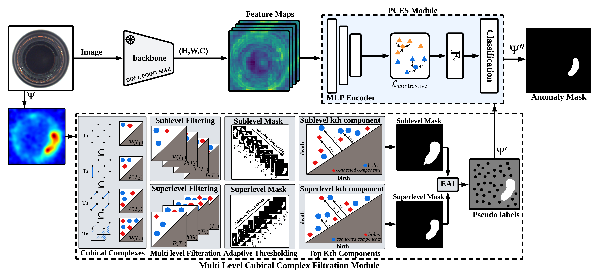

# TopoTTA: Topology-Aware Test-Time Adaptation for Unsupervised Anomaly Detection


**Authors:**  
[Ali Zia](https://scholar.google.com/citations?user=BVBJ06QAAAAJ), 
[Usman Ali](https://scholar.google.com/citations?user=2A32xVQAAAAJ), 
[Abdul Rehman](https://scholar.google.com/citations?user=ZTuS-yUAAAAJ), 
[Umer Ramzan](https://scholar.google.com/citations?user=D3AhoccAAAAJ), 
[Kang Han](https://scholar.google.com/citations?user=nIZmei8AAAAJ), 
[Muhammad Faheem](https://scholar.google.com/citations?user=qhs4RWQAAAAJ), 
[Shahnawaz Qureshi](https://scholar.google.com/citations?user=_pblOBEAAAAJ), 
[Wei Xiang](https://scholar.google.com/citations?user=VxQUr90AAAAJ&hl)

---

## 🧠 Overview

Test-time adaptation (TTA) has emerged as a promising paradigm for mitigating distribution shifts in deep models. However, existing TTA approaches for anomaly segmentation remain limited by their reliance on pixel-level heuristics, such as confidence thresholding or entropy minimisation, which fail to preserve structural consistency under noise and texture variation. Moreover, they typically treat anomaly maps as flat intensity fields, ignoring the higher-order spatial relationships that characterise complex defect geometries.
We introduce TopoTTA (Topological Test-Time Adaptation), a novel framework that integrates persistent homology, a tool from topological data analysis, into the TTA pipeline to enforce geometric and structural coherence during adaptation. By applying multi-level cubical complex filtration to anomaly score maps, TopoTTA derives robust topological pseudo-labels that guide a lightweight test-time classifier, enhancing segmentation quality without retraining the backbone model. The approach eliminates heuristic thresholding, preserves connectivity, and generalises across both 2D and 3D modalities. Extensive experiments across five standard benchmarks (MVTec AD, VisA, Real-IAD, MVTec 3D-AD, and AnomalyShapeNet) demonstrate an average 15\% F1 improvement over state-of-the-art unsupervised anomaly detection and segmentation methods, with the largest gains on anomalies exhibiting complex geometric or structural variations. These findings suggest that integrating topological reasoning into test-time adaptation provides a principled route to structure-aware generalisation, bridging the gap between geometric learning and robust adaptation.

---

## 🏗️ Architecture Overview

Below is the architecture of **TopoTTA**:
Given a test image \( I \), an AD\&S method produces an anomaly score map \( \Psi \). A pre-trained feature extractor \( F \) generates dense feature maps from \( I \). Topological pseudo-labels are extracted by applying multi-level cubical complex filtrations (both sublevel and superlevel) to \( \Psi \), producing structurally meaningful binary masks via persistent homology. These masks are fused using EAI to generate sparse pseudo-labels. A lightweight classifier is then trained on selected feature points from \( F(I) \) using these labels and applied across the full feature map to produce a refined binary AS.  


---

## ⚙️ System Specifications

- **OS:** Ubuntu 24.04  
- **GPU:** NVIDIA RTX 5090  
- **Python:** 3.13+  

---

## 🧩 Environment Setup

Create and activate the environment:
```bash
conda create --name TopoTTA --file requirements.txt
conda activate TopoTTA
```

---

## 📊 Data Placement Guide

### 1. **Dataset Structure**
Place your dataset (e.g., **MVTec AD**, **VisA**) inside the `datasets/` directory.

Example for **MVTec AD**:
```
datasets/
└── mvtec/
    ├── bottle/
    │   ├── train/
    │   ├── test/
    │   └── ground_truth/
    ├── cable/
    └── ...
```

Update dataset paths in your config file or in the command line:
```bash
--dataset_path ./datasets/mvtec
```
---

### 2. **Anomaly Score Placement**
Each class should have its corresponding folder inside `anomaly_scores/`.

Example:
```
anomaly_scores/
└── bottle/
    ├── sample01.npy/
    ├── sample02.npy/
    └── .../
```
---

## ⚡ MLP Training Parameters

- `--mlp_few_shot`: number of few-shot samples per class (ignored if `--mlp_train_fraction` > 0)  
- `--mlp_train_fraction`: fraction of training data to use (e.g., 0.3 = 30%)  

If you pass a fraction value, the few-shot parameter will be **ignored**.

---

## 🚀 Usage Example

```bash
python main.py
```
